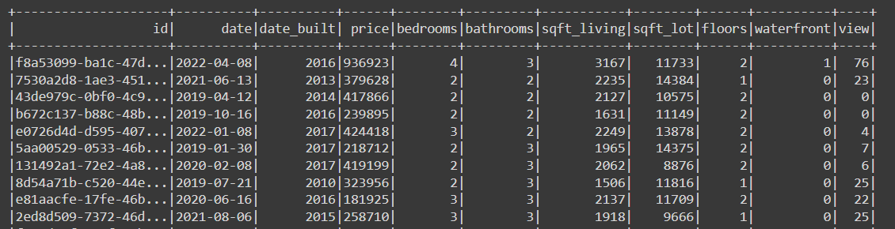
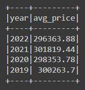
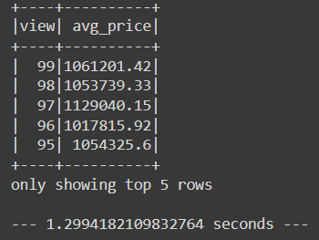
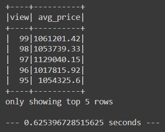
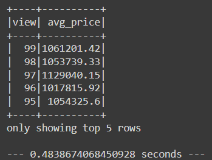

# Home_Sales

The purpose of this challenge was to utilize knowledge of SparkSQL to determine key metrics about home sales data. Next, it was to use Spark to create temporary views, partition the data, cache and uncache a temporary table, and verify that the table has been uncached.

<h3>Instructions</h3>
<ol>
<li>Rename the Home_Sales_starter_code.ipynb file as Home_Sales.ipynb.</li>
<li>Import the necessary PySpark SQL functions for this assignment.</li>
<li>Read the home_sales_revised.csv data in the starter code into a Spark DataFrame.</li>
<figure>
    
    <figcaption>Fig. 1 - Initial Dataset</figcaption>
</figure>
<li>Create a temporary table called home_sales.</li>
<li>Answer the following questions using SparkSQL:</li>
    <ul>
    <li>What is the average price for a four-bedroom house sold for each year? Round off your answer to two decimal places.</li>
    <figure>
        
        <figcaption>Fig. 2 - Spark SQL query</figcaption>
    </figure>
    <li>What is the average price of a home for each year the home was built, that has three bedrooms and three bathrooms? Round off your answer to two decimal places.</li>
    <li>What is the average price of a home for each year the home was built, that has three bedrooms, three bathrooms, two floors, and is greater than or equal to 2,000 square feet? Round off your answer to two decimal places.</li>
    <li>What is the average price of a home per "view" rating having an average home price greater than or equal to $350,000? Determine the run time for this query, and round off your answer to two decimal places.</li>
    <figure>
        
        <figcaption>Fig. 3 - Timed query: high rating</figcaption>
    </figure>
    </ul>
<li>Cache your temporary table home_sales.</li>
<li>Check if your temporary table is cached.</li>
<li>Using the cached data, run the last query that calculates the average price of a home per "view" rating having an average home price greater than or equal to $350,000. Determine the runtime and compare it to uncached runtime.</li>
<figure>
    
    <figcaption>Fig. 4 - Timed query: cached table</figcaption>
</figure>
<li>Partition by the "date_built" field on the formatted parquet home sales data.</li>
<li>Create a temporary table for the parquet data.</li>
<li>Run the last query that calculates the average price of a home per "view" rating having an average home price greater than or equal to $350,000. Determine the runtime and compare it to uncached runtime.</li>
<figure>
    
    <figcaption>Fig. 5 - Timed query: partitioned date</figcaption>
</figure>
<li>Uncache the home_sales temporary table.</li>
<li>Verify that the home_sales temporary table is uncached using PySpark.</li>
</ol>